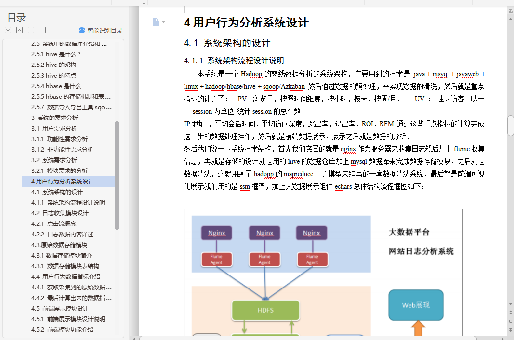
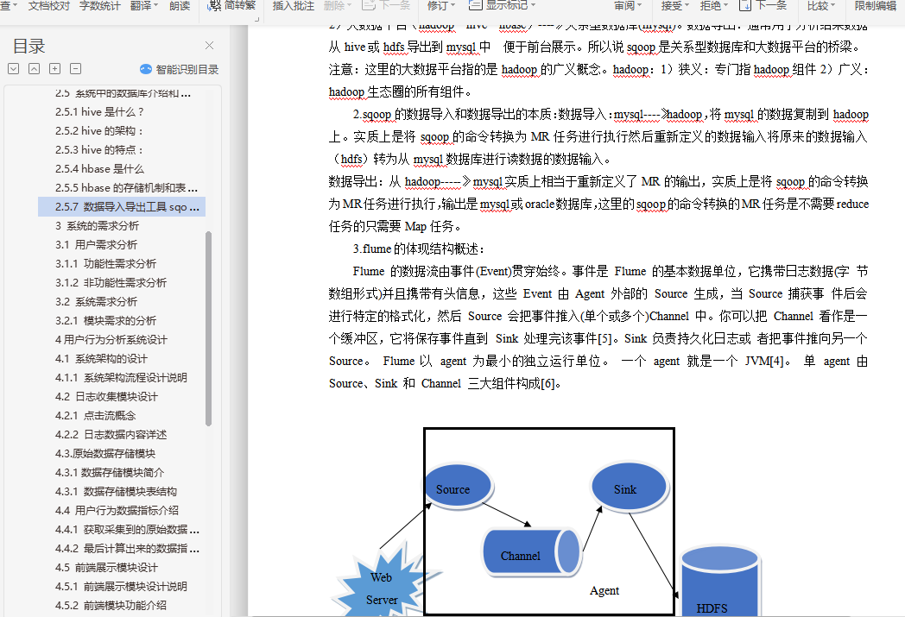

# 计算机毕业设计Hadoop+Spark+Hive+Sqoop电商网站用户行为分析系统 电商大数据 电商数据分析 电商可视化 大数据毕业设计 数据仓库 大数据毕业设计 大数据毕设

## 要求
### 源码有偿！一套(论文 PPT 源码+sql脚本+教程)

演示视频

https://www.bilibili.com/video/BV1wz4y1n7BB/?spm_id_from=333.999.0.0

### 
### 加好友前帮忙start一下，并备注github有偿课程推荐
### 我的QQ号是2827724252或者798059319或者 1679232425或者微信:bysj2023nb

# 

### 加qq好友说明（被部分 网友整得心力交瘁）：
    1.加好友务必按照格式备注
    2.避免浪费各自的时间！
    3.当“客服”不容易，repo 主是体面人，不爆粗，性格好，文明人。

# 资料

# 开发技术
**数据分析层**

- MapReduce
- Hive
- SparkSQL
- SparkCore
- azkaban/crontab
- Hive + HBase(SQL)
- HBase + Phoenix

**数据展示层**

- Sqoop 导入到 MySQL 或是HBase
- 结合三大框架： Spring + Sturts2 + MyBatis ==> SSM
- Echarts工具

# 特色/创新点
Hive数据仓库分层、大屏统计、MapReduce计算、Spark实时数仓、Hive离线数仓、Sqoop数据导入导出

# 运行截图

![(1.png)

# 运行视频(B站)

https://www.bilibili.com/video/BV1wz4y1n7BB/?spm_id_from=333.999.0.0

